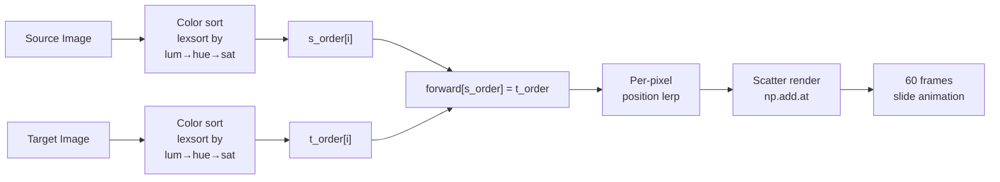

# Pixelification

A terminal tool that rearranges pixels from a source image to approximate a target image using optimal transport via color sorting — then animates each pixel physically sliding to its new position.

No pixels are created. Every pixel in the output comes from the source image, just rearranged.

## How it works



1. **Sort by colour** — every pixel in both images is sorted by luminance, then hue, then saturation. The darkest source pixel gets rank 0, the lightest gets rank *N*−1. Same for the target.

2. **Map by rank** — a source pixel with rank *i* maps to the target position with rank *i*. This is the optimal transport: the *i*th darkest pixel in the source ends up where the *i*th darkest pixel was in the target.

```
   Source pixels (sorted)         Target positions (sorted)
   ┌─────────────────────┐       ┌─────────────────────┐
   │  rank 0 (darkest)   │──────→│  rank 0             │
   │  rank 1             │──────→│  rank 1             │
   │  rank 2             │──────→│  rank 2             │
   │  ...                │       │  ...                │
   │  rank N−1 (lightest)│──────→│  rank N−1           │
   └─────────────────────┘       └─────────────────────┘
```

3. **Animate** — each pixel slides from its original position to its mapped position over 60 frames using linear interpolation. All pixels move simultaneously. When multiple pixels land on the same display cell, their colours are averaged.

```
   Frame 0               Frame 30              Frame 60
   ┌────────┐            ┌────────┐            ┌────────┐
   │• •     │            │  ••    │            │   ••   │
   │  ••    │  ───────→  │ • ••   │  ───────→  │ ••     │
   │   • •  │    lerp    │    • • │    lerp    │ •  •   │
   └────────┘            └────────┘            └────────┘
   source positions      midway                target positions
```

## Installation & Usage

### Using uv (Recommended)

```bash
# Install from source
uv tool install .

# Or run directly
uv run pixelification
```

### From PyPI

Once published, you can install it via:

```bash
pip install pixelification
```

Then run it:

```bash
pixelification
```

### Keyboard Controls

A keyboard-navigated terminal interface opens. Use arrow keys to select images, press Enter to run.

```
↑↓  navigate  •  Enter  select  •  1-4  shortcut  •  q  quit
```

An OpenCV window opens with three panels:

| Source | Target | Reconstruction |
|--------|--------|----------------|
| Your image | Layout to approximate | Pixels sliding into place |

Press `ESC` or `q` during the animation to quit.

## Requirements

- Python 3.10+
- OpenCV (`cv2`)
- NumPy
- `prompt_toolkit`

Cross-platform support is included for Windows, Linux, and macOS. 
- **Windows**: Uses native PowerShell file dialogs.
- **Linux/macOS**: Uses `tkinter` for file dialogs. On Linux, ensure `tkinter` is installed (e.g., `sudo apt install python3-tk`). On macOS, it is typically included with Python installations.

## Rust Component (Aster Browser)

The codebase also contains a Rust-based Win32 application. This component is currently only supported on Windows.
To build the Rust component (Windows only):

```bash
cargo build --release
```
