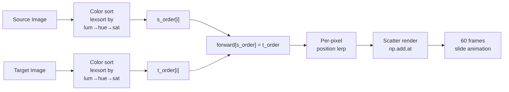

# Pixelification

A terminal tool that rearranges pixels — either between two images or across video frames — using optimal transport via colour sorting.

No pixels are created. Every pixel in the output comes from the source, just rearranged.

## Modes

### Image Mode

Rearrange pixels from a **source image** to approximate the layout of a **target image**, then watch a 60-frame pixel-sliding animation.

#### How it works



1. **Sort by colour** — every pixel in both images is sorted by luminance, then hue, then saturation. The darkest source pixel gets rank 0, the lightest gets rank *N*−1. Same for the target.

2. **Map by rank** — a source pixel with rank *i* maps to the target position with rank *i*. This is the optimal transport: the *i*th darkest pixel in the source ends up where the *i*th darkest pixel was in the target.

3. **Animate** — each pixel slides from its original position to its mapped position over 60 frames using linear interpolation. All pixels move simultaneously. When multiple pixels land on the same display cell, their colours are averaged.

### Video Mode

Rearrange every frame of a **source video** (or a still image looped as a video) to match the frames of a **target video**. Each frame pair is processed with the same sort-based algorithm, then the result is written to a temporary video and played back in an OpenCV window.

```
Source frame i ──[color sort]──┐
                                ├──[rank-map]──→ output frame i ──→ video file
Target frame i ──[color sort]──┘
```

**Key differences from Image Mode:**
- **No pixel-sliding animation** — just the sort + write step, with a progress bar in the terminal
- **Aspect-ratio handling** — if source and target have different aspect ratios, the narrower video is centered with black bars ("transparent pixels") so content isn't distorted
- **Source can be a still image** — the same image is looped for every frame of the target video
- **Explicit save** — video is written to a temp file during processing; click "Save Result Video" to export to your working directory

## Installation & Usage

### Platform Notes
- **NVIDIA GPUs**: Full acceleration via CUDA (requires CUDA 12+). Works on Linux, Windows, and macOS with an NVIDIA GPU.
- **Apple Silicon (macOS)**: Supports `mlx` accelerated backend. The tool will automatically use it on ARM macs. No additional binaries are needed.
- **Intel CPU/GPU**: Runs on CPU only – the tool will fall back to NumPy. No extra packages are required.

### Using uv (Recommended)

```bash
# Install the project and its CLI as an executable
uv tool install .
```

If you already have the CLI installed and want to update it after pulling changes, run:

```bash
uv tool install . --reinstall
```

You can also run the tool without installing:

```bash
uv run pixelification
```

### From PyPI (when available)

```bash
pip install pixelification
```

Then start it:

```bash
pixelification
```

### Using uv (Recommended)

```bash
# Install from source
uv tool install .

# Or run directly
uv run pixelification
```

### From PyPI

Once published, you can install it via:

```bash
pip install pixelification
```

Then run it:

```bash
pixelification
```

Reinstall after updates — the CLI command is unchanged:

```bash
uv tool install . --reinstall
```

### Keyboard Controls

A keyboard-navigated terminal interface opens. You start at the main menu:

```
  ■ Pixel Rearrangement Tool

  ● Rearrange Images    sort pixels between two images
  ○ Rearrange Videos    sort frames between two videos
  ○ Quit                exit the application
```

| Key | Action |
|-----|--------|
| `↑` `↓` | Navigate menu items |
| `Enter` | Select highlighted item |
| `1`–`N` | Direct shortcut for each item |
| `q` / `Escape` | Quit |

### Image Mode Controls

Select source and target images, then run the rearrangement. An OpenCV window opens with three panels:

| Source | Target | Reconstruction |
|--------|--------|----------------|
| Your image | Layout to approximate | Pixels sliding into place |

Press `ESC` or `q` during the animation to quit. Click "Save Result Image" to export the result to a PNG file.

### Video Mode Controls

Select a source video (or image) and a target video, then run. A progress bar shows in the terminal:

```
Status: Video: [████████░░░░░░░░░░] 62.0% (124/200)
```

After processing, the result plays in an OpenCV window (loops until you press `ESC`/`q` or click the X button). Click "Save Result Video" to export.

If you use a still image as the source, it's automatically looped for every target frame.

## Requirements

- Python 3.10+
- OpenCV (`cv2`)
- NumPy
- `prompt_toolkit`
- Optional GPU accelerators (installed automatically on supported platforms):
    - **NVIDIA CUDA**: `cupy-cuda12x` (Linux/Windows) – for NVIDIA GPU acceleration
    - **Apple Silicon**: `mlx` (macOS arm64 only) – for Metal acceleration

Cross-platform support is included for Windows and Linux. On Linux, ensure `tkinter` is installed (e.g., `sudo apt install python3-tk`) for the file dialog fallback.

## Rust Component (Aster Browser)

The codebase also contains a Rust-based Win32 application. This component is currently only supported on Windows.
To build the Rust component (Windows only):

```bash
cargo build --release
```
